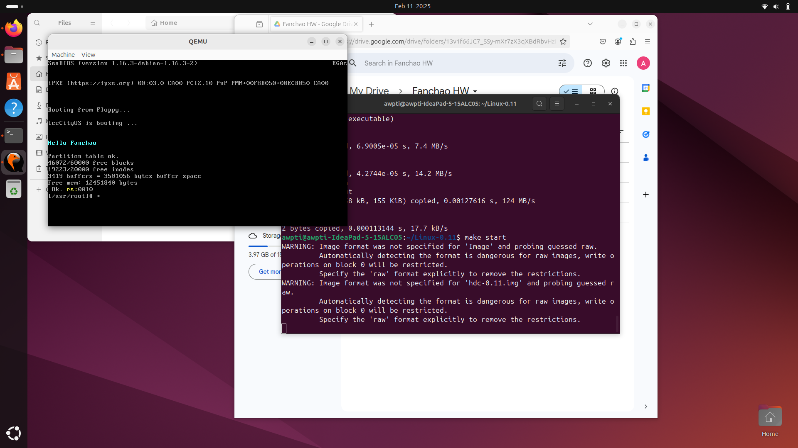

# Linux 0.11's Boot Loader Analysis

This Assignment covers the compiling and booting of Linux 0.11 and what it actually does.

## Steps To Run
This was tested and run on Ubuntu **24.04.1** LTS with source code from https://github.com/yuan-xy/Linux-0.11 and using the following packages:
```
$ sudo apt install build-essential qemu-user-static qemu-system gcc make bin86
```

Then in the directory run the following to launch the OS in Qemu:
```
$ make clean
$ make 
$ make start
```

**make clean** - removes all previously generated files from earlier builds (like object files and temporary binaries). It gives you a clean slate so that any old or outdated files don’t interfere with the new build.

**make** - compiles all the source code including the bootloader and kernel and links everything together, the result is a bootable image file that contains both the bootloader and the Linux kernel.

**make start** - This command takes the bootable image that “make” produced and initializes it in a virtual machine using QEMU with the image so that we can see Linux 0.11 boot up in a simulated environment.

## What The Boot Loader Does

The "Bootloader" located in ./Linux-0.11/**boot/setup.s** initializes the system by gathering necessary hardware information and loading the Linux kernel into memory before transferring control to the Linux Kernel. Let's walk through what this code is actually doing:
1. It starts by **setting us the CS, DS, and ES** (Code, Data & Extra Segments) so that the CPU knows exactly where to find things in memory, this is done in a 16-bit environment called real mode.
2. It then **jumps to \_start** which is where the main bootloader work begins.
3. It then proceeds to **collets some BIOS information** like the current cursor position, memory size, video information,,n and Hard drive data all of this is stored so that it can be used later.
4. Then it moves the bootloader **copies and moves the loaded** bootloader and kernel code to a "safe" location in memory to make room for the setup coming soon in 32-bit mode.
5. Then it **loads** the Interrupt Descriptor Table **(IDT)** and Global Descriptor Table **(GDT)**, These tables define memory segments and interrupt routines that are needed when the CPU switches to protected mode.
6. The bootloader **enables the A20 line**, which allows the processor to access memory above the **1MB limit.**
7. Then it **reprograms the 8259 Programmable Interrupt Controller** so that hardware interrupts are remapped. This avoids issues with BIOS interrupts(built-in functions that allows some software to use the hardware components without directly controlling it) and ensures that the operating system can manage interrupts properly once in protected mode.
8. Finally, the bootloader sets the **Protection Enable (PE) bit** in the CPU’s control register (CR0) to switch from 16-bit real mode to 32-bit protected mode. A far jump then transfers control to the new protected-mode code, where the **kernel takes over**.

## Bonus Task
So now right after it jumps to \_start we can display a custom message along with all the other displayed information. To do this we define a variable msg2 in the .data section at the bottom as:

```assembly
msg2:
	.byte 13,10
	.ascii "Hello Fanchao"
	.byte 13,10,13,10
```

byte 13 represents a carriage return (\r or CR) which just sets the cursor to the start of the line and byte 10 represents a Line Feed (\n or LF) which just moves the cursor to the next line.
And the .ascii directive which is just a word for a command that doesn't execute a cpu instruction but only gives the assembler some extra information and ways to organise information, stores the string "Hello Fanchao" in memory.

Now to actually display the string on the screen it happens in the block:

```assembly
	mov $0x03, %ah
	xor %bh, %bh
	int $0x10

	mov $19, %cx
	mov $0x000b,%bx
	mov $msg2,%bp
	mov $0x1301, %ax
	int $0x10
```

The first block just returns the cursor position and sets the text page to 0. In the second block, it first sets the message to be 19 characters long, it then sets the page to 0 and sets the color of the text to a light cyan, and the 3rd line sets BP(Base Pointer) to msg2. The BP is a **general-purpose register** in x86 assembly thats usually used to point to different things in memory so they can be used. It finally then Calls BIOS interrupt 0x10 (a interrupt that handles video services) to print msg2 to the screen.

## Screenshots
This is the base version without the bonus task output:


This is the final version with the custom message from the bootloader:

