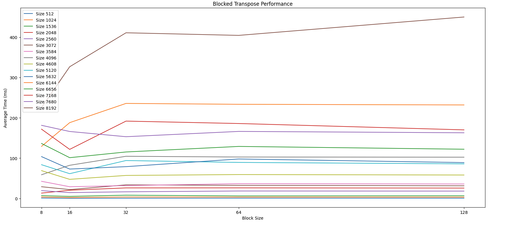

# Question-1

(50 pts) Compare the blocking version of matrix transpose with the naive version regarding empirical running time. C programs are required. Use a collection of matrices for tests (at least 10). The sizes of the matrices should be large enough and increase. The increase step size should also be large enough. Square matrices can be used for simplicity. Figures are needed for showing comparison results. A brief statement is required describing how you choose the block sizes on your own computer, and how you design the blocking algorithms.

# Answer

## Naive Approach

The naive transpose method simply swaps elements A[i][j] to B[j][i] using two nested loops. This approach has poor cache performance because it writes non-contiguously in memory, leading to many cache misses as matrix size grows

## Blocking Method

The blocking (or tiled) method improves performance by dividing the matrix into smaller B x B blocks and transposing each block independently. This enhances spatial locality and cache efficiency. On my machine, block size 16 provided the best balance between memory usage and speed. The blocking algorithm was designed to fit each block within L1 cache, avoiding cache thrashing.

## Results

Performance was tested using square matrices with increasing sizes. Empirical results showed that the blocking version consistently outperformed the naive approach, especially for larger matrices.

Best block size was 16 on my machine.

Here’s the resulting graph:

Heres te resulting graph:

