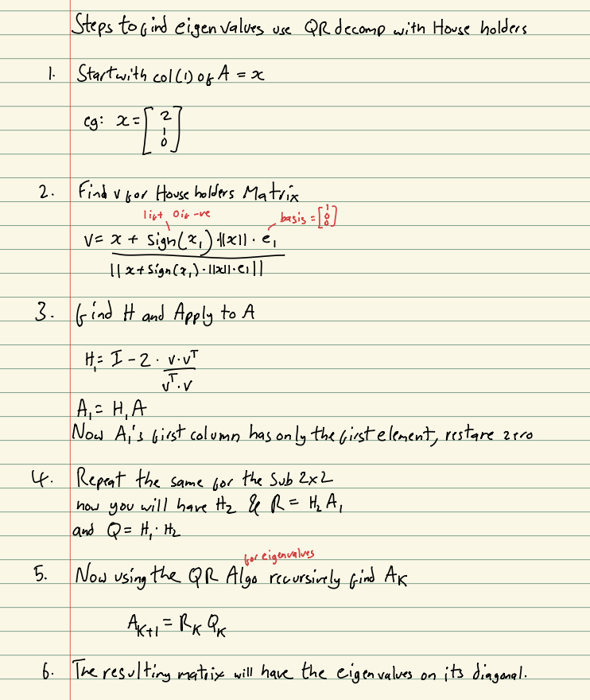

# Questions

1. (50 pts) Why the Gram-Schmidt algorithm is never preferred in the eigenvalue revealing problem? Please argue it from the condition perspective.

2. (50 pts) Give a numerically stable algorithm to compute eigenvalues, and show it in a concrete example (e.g. on a 3-by-3 matrix) step by step (both manual work and programs are acceptable), and argue why it is stable.

# Answers

## Question 1

The classic Gram-Schmidt algorithm basically converts a set of vectors into an orthonormal basis by subtracting projections to remove components. Where its issue for computers lies is that it expects mathematical accuracy and does not expect the rounding errors due to floating point binary maths. These rounding errors tend to add up for larger problems and when the vectors are linearly independent making it unstable. Now in Eigenvalue finding, its usually a recursive function that makes use of Gram-Schmidts algorithm which would lead to repeated errors making the error transfer and grows through the iterations. This would result in the Eigen values be incorrect or lose important properties. Another Error that transfers due to Gram-Schmidts round off errors is that the end "basis" would be no longer perfectly orthonormal which is basically a requirement to proceed. From the Condition perspective this basically means that when you input two matrices with small differences the result is significantly different from one another which makes it unstable for accurate calculation.

## Question 2

So our main goal for this is to replace classical Gram-Schmidt with a newer algorithm that doesn't fall victim to the mentioned rounding errors. The replacement is Householders Transformation, this algorithm uses the Householder matrix that when multiplied by the matrix instantly eliminates all lower entries. With this you bypass the repeated subtracting in Gram-Schmidt, it uses orthogonal matrices and errors don't accumulate like in QR decomposition with Gram-Schmidt. Heres How you do it manually and I also included a python program that does it accurately!

