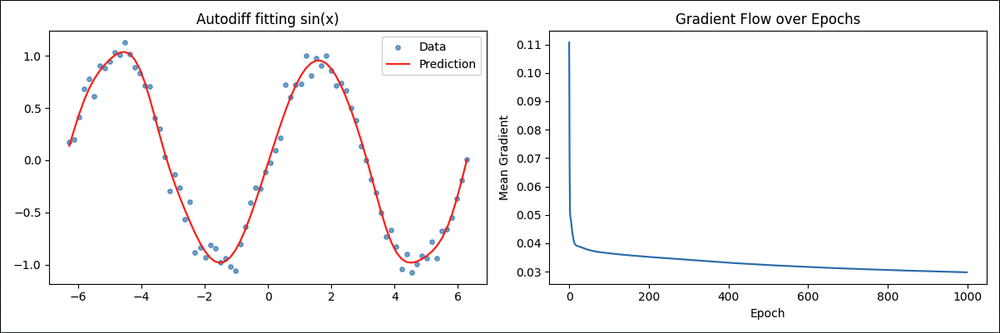

# Question-1

For this part we implemented automatic differentiation in both forward mode and reverse mode.
Basically, automatic differentiation is a way for the computer to calculate derivatives exactly by following the chain rule step by step through a computation instead of doing symbolic math or using numerical estimates.

In forward mode, each variable keeps track of its own value and how fast it changes (its derivative) as the program runs.
So when you compute something like f(x) = x² + 3x + 2, every arithmetic operation also updates the derivative automatically.
At the end, you just read the final value and its derivative.

In reverse mode, it kind of does the same thing but backwards.
The program first does a normal run to calculate the final value, then it goes back through every operation (like a chain of nodes) and uses the chain rule in reverse to see how much each variable contributed to the output.
This is the same idea that powers backpropagation in neural networks.

Both methods gave me the same result for f(x) = x² + 3x + 2 at x = 5, which shows they are working correctly.

## Sample Output

Forward mode result: \
f(x): 42.0 \
df/dx: 13.0 \
\
Reverse mode result: \
f(x): 42.0 \
df/dx: 13.0

# Question-2

For the bonus part we used my reverse-mode autodiff system to train a 3-layer feedforward neural network to approximate the function y = sin(x) with a little random noise added.
Basically, the network has an input layer, two hidden layers that use the sin activation function, and one output layer.
Each weight and bias in the network is represented by a Node, so the autodiff system can automatically calculate the gradient of the loss with respect to every parameter when we call .backward().

During training, the network predicts outputs for all points, compares them to the real sin(x) values, and computes the mean squared error.
Then it uses gradient descent to update the weights so the loss gets smaller over time.
Because the data has noise, the loss never goes to zero, but it keeps decreasing and stabilizes, which means the model learned to overfit the data just like we wanted.

The gradient-flow plot shows that the gradients start higher and then settle down as the network converges.
That’s a pretty good sign that the autodiff and backpropagation are both working correctly but it does definitely over fit to the sin function.

## Sample Output

Epoch 0 | Loss 0.048185 \
Epoch 100 | Loss 0.009859 \
Epoch 200 | Loss 0.009570 \
Epoch 300 | Loss 0.009346 \
Epoch 400 | Loss 0.009168 \
Epoch 500 | Loss 0.009053 \
Epoch 600 | Loss 0.008976 \
Epoch 700 | Loss 0.008918 \
Epoch 800 | Loss 0.008870 \
Epoch 900 | Loss 0.008829 \

